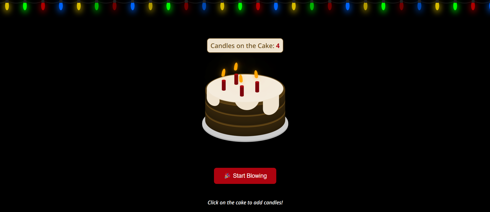

# Interactive Candle Blow Birthday Cake 🍰🎂

An interactive browser-based birthday cake experience where users can add candles, and blow them out with a fun left-right mouse gesture. This lightweight project is built using only HTML, CSS, and JavaScript, and includes colorful animated festoons to simulate a celebratory atmosphere.



## Features

- Visually styled birthday cake using layered divs
- Click to add candles with animated flames
- Dynamic candle counter display
- "Start Blowing" mode for simulating candle blowing
- Detects left-to-right mouse gestures over the candles to simulate blowing them out
- Animated lightrope (festoons) with red, blue, yellow, and green flashing lights
- Responsive and accessible user interface

## Folder Structure

```
/project-root
│
├── index.html         # Main HTML file
├── styles.css         # Cake and interface styling
├── festoons.css       # Lightrope / festoon animation styles
└── script.js          # Core interactivity and gesture detection
```

## How to Use

1. Open `index.html` in a modern browser (Chrome, Firefox, Edge, etc.).
2. Click anywhere on the cake to add candles.
3. Once candles are added, click the "Start Blowing" button.
4. Move your mouse left ↔️ right over the candles to simulate blowing.
5. After 3 swipes, the candles will blow out with a smooth animation.

## Compatibility

This project is compatible with all major modern browsers. It does not require any external libraries or frameworks other than Normalize.css and Google Fonts.

## Customization

You can easily change:

- Number of festoon lights
- Blowing gesture sensitivity
- Candle styles or animations
- Add sound effects or confetti using JavaScript

## Credits

* Inspired by a creative Instagram post ([View Github Repo](https://github.com/sherryuser/cake-blow)), this project brings the joy of celebrating with a virtual cake to your screen.
* The cake design is based on an original creation by Fazlur Rahman, originally showcased on [CodePen](https://codepen.io/fazlurr/pen/gPMJMK "Cake by Fazlur Rahman").
* The festoon design is based on an original creation by FAR1NOM, originally showcased on [CodePen](https://codepen.io/FAR1NOM/pen/zYaVraW "Festoon by FAR1NOM").
* This project includes enhancements and logic assisted by AI tools to streamline development and improve user interaction.

## Contribution

For guidelines on how to contribute to this project, please refer to the [Contribution Guide](./CONTRIBUTION.md).

## License

This project is released under the [MIT License](./LICENSE.md).
